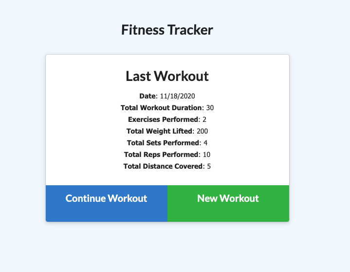
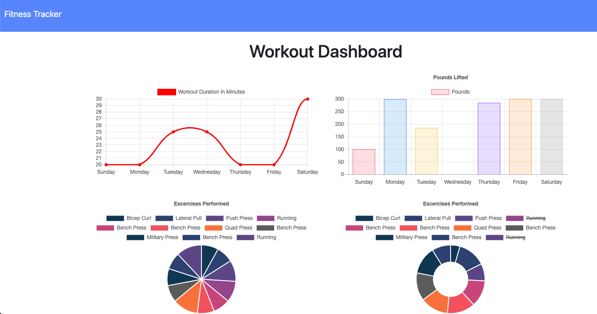

# Homework 17: Workout Tracker NoSQL Application


## Table of Contents
* [Description](#description)
* [Installation](#installation)
* [Usage](#usage)
* [Tests](#test)
* [Questions](#questions)
* [Contributing Authors](#contributors)
* [License](#license)

# Description
A workout tracker with a Mongo database, Mongoose schema, and uses Express to handle routes. The front end code in the `Develop` folder was provided. With this application, a user is able to view, create, and track daily workouts. Users can log multiple exercises in a workout on a given day and are able to track the name, type, weight, sets, reps, and duration of the exercise. If the exercise is a cardio exercise, the applicatipn tracks the distance traveled.

* <a href="https://stark-anchorage-81264.herokuapp.com/">Link to Deployed App on Heroku.</a>



    
## Installation
To use application from your local environment, you must accomplish the following steps below:

**Step 1 - Clone my repo using the command line below.**
```
git clone git@github.com:cascutter/NoSQL-Workout-Tracker.git
```
**Step 2 - Change directory to the cloned repo folder.**
```
cd NoSQL-Workout-Tracker
```
**Step 3 - Install all required NPM packages.**
```
npm install
npm install mongoose
npm install express
npm install morgan
```
**Step 4 - Start the application server using the command line below**
```
node server.js
```
    
## Usage
The application allows users to accomplish the following tasks:
* Add exercises to a previous workout plan.

* Add new exercises to a new workout plan.

* View the combined weight of multiple exercises on the `stats` page.


          
## Tests
All tests currently passing.

## Future Development
* Improve UI/UX
* Make application more responsive and mobile-first
            
## Questions
All questions regarding this application can be directed to: 
 
<a href="https://github.com/cascutter">cascutter</a> 

<a href="mailto:cascutter13@gmail.com">cascutter13@gmail.com</a>
    
# Contributing Authors
* Casandra Cutter 
    
# License
ISC License